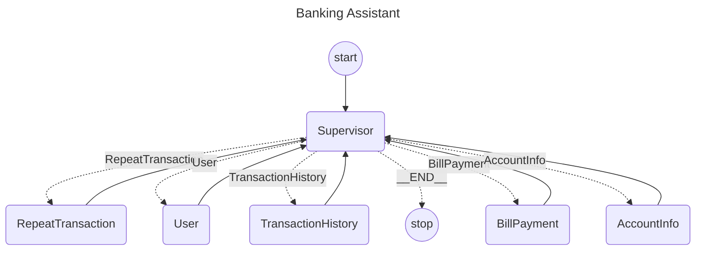

## Langgraph4j Representation

```mermaid
---
title: Banking Assistant
---
flowchart TD
__START__((start))
__END__((stop))
Supervisor("Supervisor")
User("User")
AccountInfo("AccountInfo")
BillPayment("BillPayment")
TransactionHistory("TransactionHistory")
RepeatTransaction("RepeatTransaction")
%%	condition1{"check state"}
__START__:::__START__ --> Supervisor:::Supervisor
%%	Supervisor:::Supervisor -.-> condition1:::condition1
%%	condition1:::condition1 -.->|RepeatTransaction| RepeatTransaction:::RepeatTransaction
Supervisor:::Supervisor -.->|RepeatTransaction| RepeatTransaction:::RepeatTransaction
%%	condition1:::condition1 -.->|User| User:::User
Supervisor:::Supervisor -.->|User| User:::User
%%	condition1:::condition1 -.->|TransactionHistory| TransactionHistory:::TransactionHistory
Supervisor:::Supervisor -.->|TransactionHistory| TransactionHistory:::TransactionHistory
%%	condition1:::condition1 -.->|__END__| __END__:::__END__
Supervisor:::Supervisor -.->|__END__| __END__:::__END__
%%	condition1:::condition1 -.->|BillPayment| BillPayment:::BillPayment
Supervisor:::Supervisor -.->|BillPayment| BillPayment:::BillPayment
%%	condition1:::condition1 -.->|AccountInfo| AccountInfo:::AccountInfo
Supervisor:::Supervisor -.->|AccountInfo| AccountInfo:::AccountInfo
User:::User --> Supervisor:::Supervisor
AccountInfo:::AccountInfo --> Supervisor:::Supervisor
BillPayment:::BillPayment --> Supervisor:::Supervisor
TransactionHistory:::TransactionHistory --> Supervisor:::Supervisor
RepeatTransaction:::RepeatTransaction --> Supervisor:::Supervisor

classDef ___START__ fill:black,stroke-width:1px,font-size:xx-small;
classDef ___END__ fill:black,stroke-width:1px,font-size:xx-small;
```
